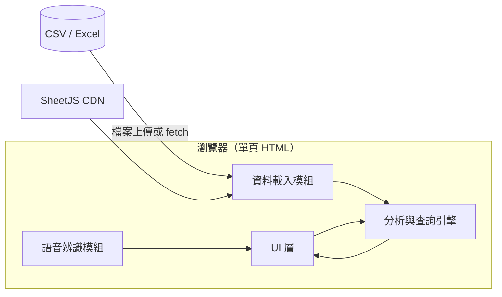
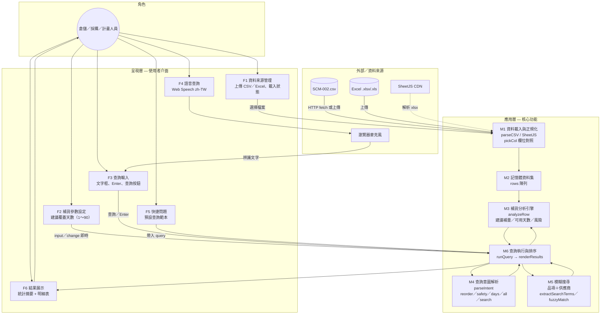
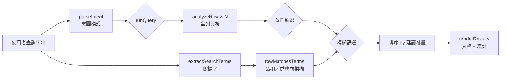
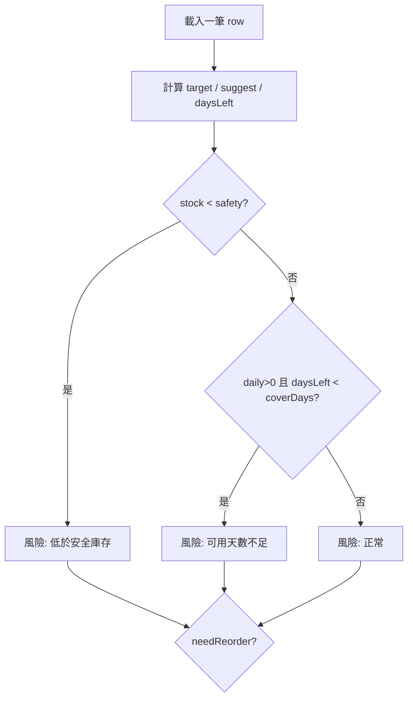

# SCM-002 庫存語音查詢 — 系統開發文件

| 項目 | 內容 |
|------|------|
| 專案代號 | SCM-002 |
| 文件版本 | 1.0.2 |
| 最後更新 | 2026-06-04 |
| 狀態 | 樣板／可運行之 PoC |
| 主要交付 | `scm-voice-query.html`（單頁應用） |

---

## 1. 專案概述

### 1.1 背景

供應鏈／倉儲人員需依庫存與用量判斷**哪些品項該補、建議補多少**。本專案以離線或本機可執行之 HTML 介面，讀取 Excel 或 CSV，並支援**自然語言（含語音）查詢**，降低操作門檻。

### 1.2 目標

| 目標 | 說明 |
|------|------|
| 資料匯入 | 支援 `.csv`、`.xlsx`、`.xls`，自動對應欄位名稱 |
| 補貨建議 | 依目前庫存、安全庫存、日均用量與「覆蓋天數」計算建議補量與風險 |
| 查詢方式 | 文字輸入、快捷問題、Web Speech API 語音（zh-TW） |
| 模糊篩選 | 品項、供應商皆可模糊比對，可與意圖篩選疊加 |
| 即時參數 | 調整「建議覆蓋天數」後立即重算結果 |

### 1.3 非目標（目前版本）

- 無後端 API、無使用者登入
- 不寫回 ERP／TIPTOP／資料庫
- 不處理多工作表 Excel 合併（僅讀取第一個工作表）
- 不支援離線語音（需瀏覽器與網路提供 CDN 之 SheetJS）

---

## 2. 系統架構

### 2.1 技術部署架構



### 2.2 專案功能架構圖

以下為 **功能模組** 與 **資料流** 視角之架構（供需求討論、分工與驗收對照）。實作均集中於 `scm-voice-query.html`。



#### 功能模組對照表

| 代號 | 功能名稱 | 說明 | 主要程式 |
|------|----------|------|----------|
| F1 | 資料來源管理 | 上傳或自動載入 CSV；Excel 經 SheetJS | `#dataFile`、`tryAutoLoad` |
| F2 | 補貨參數設定 | 覆蓋天數變更後立即重算 | `#coverDays`、`refreshOnCoverDaysChange` |
| F3 | 文字查詢 | 手動輸入自然語言問題 | `#queryText`、`#btnSearch` |
| F4 | 語音查詢 | 語音轉文字後自動查詢 | `#btnMic`、`SpeechRecognition` |
| F5 | 快捷問題 | 一鍵帶入常見查詢 | `.chip` |
| F6 | 結果展示 | 筆數統計、風險 badge、建議補量表 | `renderResults` |
| M1 | 資料載入 | 表頭別名、列正規化 | `normalizeRecords`、`parseCSV` |
| M2 | 資料集 | 執行期快取 | `rows[]` |
| M3 | 補貨分析 | 目標庫存、建議量、風險 | `analyzeRow` |
| M4 | 意圖解析 | 補貨／安全庫存／天數／全部／搜尋 | `parseIntent` |
| M5 | 模糊搜尋 | 品項、供應商關鍵字 AND | `fuzzyMatch`、`rowMatchesTerms` |
| M6 | 查詢執行 | 篩選、排序、輸出 DOM | `runQuery` |

#### 查詢功能子架構



> **圖例**：實線為主要資料流；虛線為外部 CDN 依賴。§2.1 偏重部署與技術元件，§2.2 偏重業務功能與模組分工。

### 2.3 技術棧

| 層級 | 技術 |
|------|------|
| 前端 | HTML5、CSS3、原生 JavaScript（無框架） |
| Excel 解析 | [SheetJS (xlsx)](https://cdn.jsdelivr.net/npm/xlsx@0.18.5/) |
| CSV 解析 | 內建 `parseCSV()` |
| 語音 | Web Speech API（`SpeechRecognition` / `webkitSpeechRecognition`） |
| 執行環境 | 現代瀏覽器；本機建議以 `http.server` 提供靜態檔 |

### 2.4 目錄結構

```
D:\SCM-002\
├── README.md                 # 專案入口、快速開始
├── scm-voice-query.html      # 主程式（唯一程式碼檔）
├── SCM-002.csv               # 範例資料
└── docs\
    └── 系統開發文件.md        # 本文件
```

---

## 3. 資料規格

### 3.1 實體與檔案

- **邏輯實體**：一筆資料代表「某品項 × 某供應商（可空）」的庫存快照。
- **實體檔**：`SCM-002.csv` 或團隊提供之 Excel，檔名可自訂，由使用者上傳載入。

### 3.2 必要欄位

| 欄位（建議名稱） | 型別 | 必填 | 說明 |
|------------------|------|------|------|
| 品項 | 文字 | 建議 | 空白時顯示為 `(未命名)` |
| 目前庫存 | 數值 | **是** | 現有庫存量 |
| 安全庫存 | 數值 | **是** | 安全水位 |
| 日均用量 | 數值 | **是** | 每日平均消耗量 |
| 供應商 | 文字 | 否 | 可空白 |

### 3.3 欄位別名對照（程式自動辨識）

程式透過 `COL` 常數與 `pickCol()` 比對表頭，支援中英文別名：

| 邏輯欄位 | 可接受表頭名稱 |
|----------|----------------|
| 品項 | 品項、品名、產品、item、product |
| 目前庫存 | 目前庫存、庫存、現有庫存、stock、on_hand |
| 安全庫存 | 安全庫存、安全存量、safety、safety_stock |
| 日均用量 | 日均用量、日用量、平均日用量、daily_usage、avg_daily |
| 供應商 | 供應商、廠商、vendor、supplier |

缺少「目前庫存、安全庫存、日均用量」任一等欄位時，載入會拋錯：`找不到必要欄位：...`

### 3.4 資料品質注意事項

- 數值可含千分位逗號，程式會移除後轉 `Number`。
- 空字串、非數字 → 該欄位為 `null`，顯示為 `—`。
- 品項、供應商、數值**全空**之列會略過。
- 範例資料中可能存在品項空白列，實務匯出時建議清理。

### 3.5 範例資料列

```csv
品項,目前庫存,安全庫存,日均用量,供應商
湯包,389,29,146,綠源
布丁,90,16,57,益昌
```

---

## 4. 業務邏輯 — 補貨與風險

### 4.1 參數

| 參數 | UI 元素 | 預設 | 範圍 |
|------|---------|------|------|
| 建議覆蓋天數 | `#coverDays` | 7 | 1～90 |

變更時觸發 `input` / `change` → `refreshOnCoverDaysChange()` → 以目前查詢字串重跑 `runQuery()`。

### 4.2 計算公式（`analyzeRow`）

設：

- `stock` = 目前庫存（缺省視為 0）
- `safety` = 安全庫存（缺省視為 0）
- `daily` = 日均用量（缺省視為 0）
- `coverDays` = 建議覆蓋天數

則：

```
target      = safety + daily × coverDays
suggest     = max(0, ceil(target - stock))
daysLeft    = daily > 0 ? stock / daily : (stock > 0 ? 999 : 0)
belowSafety = stock < safety
lowCover    = daily > 0 且 daysLeft < coverDays
needReorder = suggest > 0 且 (belowSafety 或 lowCover)
```

### 4.3 風險等級

| 條件 | 顯示 | CSS class |
|------|------|-----------|
| `stock < safety` | 低於安全庫存 | `badge-danger` |
| 否則且 `daysLeft < coverDays`（且 daily > 0） | 可用天數不足 | `badge-warn` |
| 其餘 | 正常 | `badge-ok` |

### 4.4 流程圖



---

## 5. 查詢引擎

### 5.1 處理流程

```
runQuery(query)
  → parseIntent(query)     // 意圖 + 關鍵字
  → rows.map(analyzeRow)   // 全量分析
  → 依 intent.mode 篩選
  → 依 terms 模糊篩選（品項 OR 供應商）
  → 依 suggest 降序排序
  → renderResults()
```

### 5.2 查詢意圖（`parseIntent`）

| mode | 觸發條件（關鍵字示意） | 篩選行為 |
|------|------------------------|----------|
| `all` | 全部、所有、列出 | 不額外過濾（仍可套模糊關鍵字） |
| `below_safety` | 安全庫存、安全存量 | `belowSafety === true` |
| `low_days` | 可用天數、天數不足、幾天 | `lowCover === true` |
| `reorder` | 補多少、該補、補貨、建議；或空查詢預設 | `needReorder === true` |
| `search` | 有抽出關鍵字但無上述補貨意圖 | 僅模糊篩選，不限定需補貨 |

意圖與模糊篩選為 **AND** 關係。

### 5.3 模糊查詢（品項、供應商）

1. **`extractSearchTerms(query)`**  
   - 移除 `STOP_WORDS`（如：哪些、品項、該補、庫存…）。  
   - 抽出中文連續字或英數字 token，去重。

2. **`fuzzyMatch(haystack, needle)`**  
   - 正規化：小寫、去空白。  
   - 子字串包含；或 **子序列匹配**（例：「益」可對到「益昌」）。

3. **`rowMatchesTerms(row, terms)`**  
   - **每個** term 必須在 `item` **或** `vendor` 至少一欄模糊命中（AND across terms）。

### 5.4 查詢範例

| 使用者輸入 | 意圖 | 模糊 terms | 結果概要 |
|------------|------|------------|----------|
| 哪些品項該補多少 | reorder | （無） | 所有需補貨列 |
| 益昌 布丁 | search | 益昌、布丁 | 兩關鍵字皆需命中之列 |
| 益昌 布丁該補多少 | reorder | 益昌、布丁 | 需補貨且符合模糊 |
| 庫存低於安全庫存 | below_safety | 低於、庫存…可能被去掉 | 低於安全庫存列 |
| 顯示全部品項建議 | all | 品項、建議等可能被去掉 | 視殘留 terms 而定 |

> **維護提示**：若「低於安全庫存」查詢結果不對，請檢查 `STOP_WORDS` 是否誤刪有效關鍵字，或調整意圖比對優先順序。

### 5.5 內建快捷查詢（chips）

| data-q | 用途 |
|--------|------|
| 哪些品項該補多少 | 預設補貨清單 |
| 益昌 布丁 | 模糊查詢範例 |
| 庫存低於安全庫存的品項 | 安全庫存風險 |
| 可用天數不足七天的品項 | 可用天數風險 |
| 顯示全部品項建議 | 全資料（含分析欄位） |

---

## 6. 使用者介面模組

### 6.1 畫面區塊

| 區塊 | ID / 類別 | 功能 |
|------|-----------|------|
| 資料來源 | `#dataFile`, `#dataStatus` | 上傳檔案、顯示載入狀態 |
| 補貨參數 | `#coverDays` | 覆蓋天數，即時重算 |
| 查詢 | `#queryText`, `#btnMic`, `#btnSearch`, `.chip` | 輸入、語音、快捷 |
| 結果摘要 | `#summary`, `#statTotal`, `#statNeed`, `#statQty` | 統計 |
| 結果表格 | `#resultTable`, `#resultBody` | 明細 |

### 6.2 結果欄位

| 欄位 | 來源 |
|------|------|
| 品項、供應商、目前庫存、安全庫存、日均用量 | 原始資料 |
| 可用天數 | `daysLeft`（小數 1 位） |
| 風險 | `risk` + badge |
| 建議補量 | `suggest`（0 顯示 —） |

### 6.3 語音模組

- 語系：`zh-TW`
- 不支援時：`#btnMic` disabled，提示改用 Chrome / Edge
- 成功：`onresult` → 填入 `#queryText` 並 `runQuery(text)`
- 錯誤：顯示於 `#voiceStatus`

---

## 7. 核心函式對照（開發者）

| 函式 | 職責 |
|------|------|
| `pickCol` / `normalizeRecords` | 表頭對應、列正規化 |
| `parseCSV` | CSV 解析（支援引號內逗號） |
| `loadRows` | 寫入記憶體 `rows[]` |
| `analyzeRow` | 單筆補貨與風險計算 |
| `extractSearchTerms` | 查詢關鍵字抽取 |
| `fuzzyMatch` / `rowMatchesTerms` | 模糊比對 |
| `parseIntent` | 意圖判斷 |
| `runQuery` | 查詢主流程 |
| `renderResults` | DOM 輸出（含 `esc` XSS 防護） |
| `tryAutoLoad` | `fetch('SCM-002.csv')` 僅 HTTP 環境有效 |

全域狀態：`let rows = []`（僅存在於瀏覽器記憶體，重新整理即清空）。

---

## 8. 環境建置與執行

### 8.1 本機開發

```powershell
cd D:\SCM-002
python -m http.server 8080
# 或: npx --yes serve -p 8080
```

### 8.2 無 HTTP 伺服器

1. 雙擊 `scm-voice-query.html`
2. 手動「選擇檔案」載入 CSV／Excel
3. 語音仍可用（HTTPS 或 localhost 較穩定，依瀏覽器政策）

### 8.3 內部部署建議

| 方式 | 說明 |
|------|------|
| 靜態檔伺服器 | IIS、Nginx、物件儲存 + CDN |
| 內網共用 | 將 `SCM-002` 資料夾放共用路徑，統一啟動方式寫入 SOP |
| SheetJS | 目前依 CDN；air-gap 環境需改為本地 `xlsx.full.min.js` |

---

## 9. 團隊協作指引

### 9.1 分支與修改建議

| 變更類型 | 建議作法 |
|----------|----------|
| 調整補貨公式 | 修改 `analyzeRow`，更新本文件 §4，並與業務確認 |
| 新增查詢意圖 | 擴充 `parseIntent` + `runQuery` 篩選分支 |
| 新增欄位 | 擴充 `COL`、`normalizeRecords`、表格 thead 與 `renderResults` |
| UI 主題 | 修改 `<style>` 內 CSS 變數 `:root` |
| 拆分模組 | 現為單檔 PoC；可拆成 `js/data.js`、`js/query.js` 等 |

### 9.2 程式碼審查檢查清單

- [ ] 新欄位是否加入 `COL` 別名與文件 §3
- [ ] `esc()` 是否用於所有使用者／資料來源文字輸出至 HTML
- [ ] 修改 `STOP_WORDS` 是否影響既有查詢案例
- [ ] 覆蓋天數變更是否仍觸發即時更新
- [ ] Excel 多 sheet 需求是否需另開議題

### 9.3 測試案例（手動）

| # | 步驟 | 預期 |
|---|------|------|
| T1 | HTTP 啟動後開啟頁面 | 自動載入 CSV，顯示補貨建議 |
| T2 | 上傳含別名表頭之 xlsx | 成功載入筆數 |
| T3 | 查詢「益昌 布丁」 | 僅相關列 |
| T4 | 覆蓋天數 7→14 | 表格與建議補量即時變化 |
| T5 | 語音「哪些品項該補多少」 | 辨識後結果與 T1 類似 |
| T6 | 缺必要欄位之檔案 | 顯示錯誤訊息於 `#dataStatus` |

---

## 10. 已知限制與風險

| 項目 | 說明 |
|------|------|
| 同品項多供應商 | 資料為多列，不自動彙總；查詢為列級 |
| 語音準確度 | 受麥克風、口音、瀏覽器影響 |
| 大檔效能 | 全量載入記憶體，數萬列可能卡頓 |
| CDN 依賴 | 無網路時 Excel 無法解析 |
| CORS | 僅 `fetch` 同目錄 CSV；跨域需伺服器設定 |
| 補貨公式 | 為樣板邏輯，**不等於** ERP 正式補貨政策 |

---

## 11. 後續規劃（Backlog）

優先級供團隊排程參考：

| 優先 | 項目 |
|------|------|
| P1 | 與 TIPTOP／ERP 匯出格式欄位對齊確認 |
| P1 | SheetJS 改本地佈署、版本鎖定 |
| P2 | 品項＋供應商分組彙總、建議補量合計 |
| P2 | 匯出查詢結果為 CSV／Excel |
| P3 | 查詢紀錄、參數 preset 儲存（localStorage） |
| P3 | 後端 API + 定期同步庫存（取代手動上傳） |
| P4 | 拼音／同義詞模糊（提升語音錯字容忍） |

---

## 12. 版本紀錄

| 版本 | 日期 | 說明 |
|------|------|------|
| 1.0.2 | 2026-06-04 | 新增 HTML 報告版 `系統開發文件.html` |
| 1.0.1 | 2026-06-04 | 新增 §2.2 專案功能架構圖（Mermaid）與模組對照表 |
| 1.0.0 | 2026-06-04 | 初版：語音查詢、補貨建議、模糊查詢、覆蓋天數即時更新、系統開發文件 |

---

## 13. 聯絡與文件維護

- 修改程式邏輯時，請**同步更新**本文件對應章節與 §12 版本紀錄。
- 專案入口說明見根目錄 `README.md`。
- **HTML 報告版**（簡約深藍白、內容精簡）：`docs/系統開發文件.html`

---

*文件結束*
